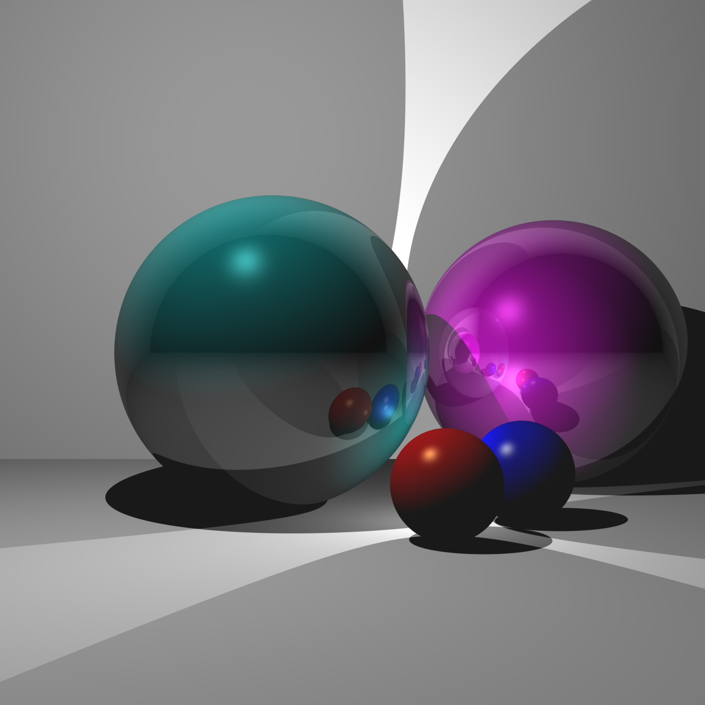

# Raytracer

## Summary

Implementation of a cross-platform Ray Tracer using C++ and the GLM library.

    
   

Ray tracing is a rendering technique used to generate realistic images by simulating the behavior of light. It works by "tracing" rays from the camera's viewpoint into the scene, intersecting them with objects in the scene, and calculating the color of each intersection point based on lighting and material properties. By recursively tracing reflected and refracted rays, it simulates complex light interactions, resulting in high quality renderings.

## Features 

- **Complex lighting**: Supports multiple Phong lights (Ambient, Diffuse, and Specular lighting) 
- **Shadows**: Ray intersection checks ensure a surface is only lit if it is not obscured
- **Blended recursive reflections**: Supports reflective materials that can be blended with phong lighting
- **Anti-aliasing**: Casts multiple rays per pixel and averages the result to smooth edges
- **Optimized model rendering**: Optimizes ray intersection checks for complex models using bounding spheres and boxes

## Dependencies

* CMake v3.* (building)
* GLM v0.9.* (matrix and vector math)

Build with CMake then run with `./Raytracer <SCENE> <IMAGE SIZE> <IMAGE FILENAME>`

## Scene Info

* Scene 0 -> blended reflection
* Scene 1 -> single light no shadows
* Scene 2 -> single light with shadows
* Scene 3 -> multiple lights with shadows
* Scene 4 -> Single reflection
* Scene 5 -> Recursive reflections
* Scene 6 -> Custom mesh w/o model transformation
* Scene 7 -> Custom mesh w/ model transformation
* Scene 9 -> anti-aliasing
* Scene 10 -> combined blended reflection and anti-aliasing
